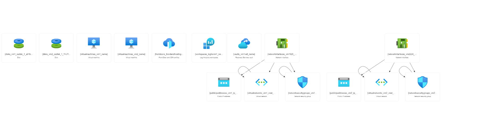

# Azure Front Door Service

Azure Front Door Service is a global CDN and application accelerator that improves performance and enhances security by caching and delivering content from edge locations closest to users. It offers intelligent routing and SSL offloading for optimized application delivery.

## Steps to be followed

1. Creating virtual machines
2. Configuring Azure Front Door
3. Configuring Frontend and Backend
4. Adding a routing rule

## Services

Azure frontdoor

## Resource visualizer

## Documentation

[parameters](parameters.json)
[template](template.json)
