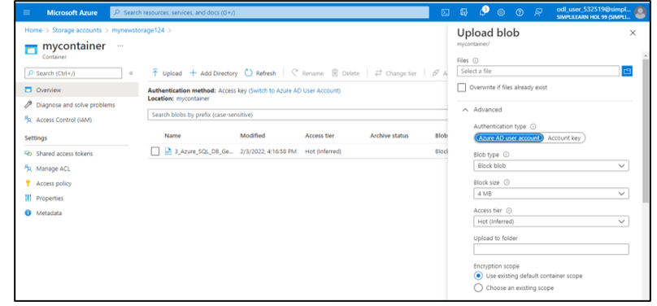
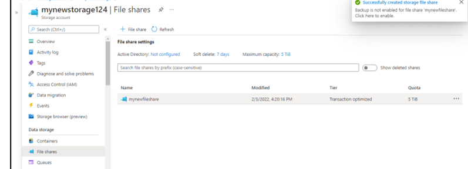
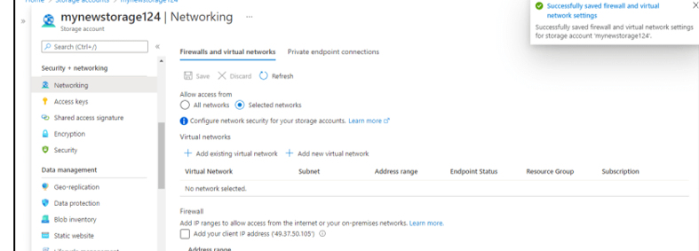

# Manage Azure Storage

Azure Storage Service is a cloud-based storage solution provided by Microsoft Azure. It offers scalable and durable storage for various types of data, including blobs, files, queues, and tables. It provides high availability, redundancy, and seamless integration with other Azure services, making it a reliable choice for storing and managing data in the cloud.

## Steps to be followed

1. Creating a Storage account
2. Managing blob storage
3. Managing authentication and authorization for Azure Storage
4. Creating and configuring an Azure File share
5. Managing network access for Azure Storage

## Services

Azure Storage

## Screenshots

### authentication for storage

### configuring an Azure File share

### Managing network access for Azure Storage

