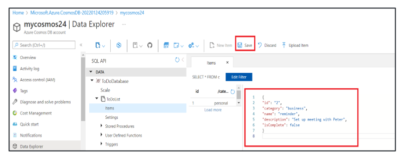
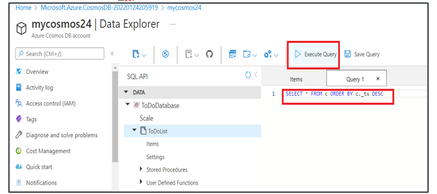

# Managing Cosmos DB

create a Cosmos DB account and identify different options for deploying and configuring Cosmos DB. You also need to add some data to the Cosmos DB to check its functionality further by running queries.

## Steps to be followed

1. Creating a Cosmos DB account
2. Creating a database
3. Adding some data to the cosmos DB database
4. Querying the data using SQL APIs

## Services

Azure Cosmos DB

## Screenshots

### Adding data to the Cosmos DB database

Now, add data to the Cosmos DB. Go to Cosmos DB and then Data Explorer. Expand ToDoDatabase and then ToDoList and click Items and then New Item
Replace the selected data with the below value, and click on Save
{
"id": "1",
"category": "personal",
"name": "groceries",
"description": "Pick up apples and strawberries",
"isComplete": false
}

Similarly, add the next item, and click on Save

{
"id": "2",
"category": "business",
"name": "reminder",
"description": "Set up meeting with Peter",
"isComplete": false
}

### Querying the data using SQL APIs

Now, query the data by running SQL queries. To run a query, click on the icon as below and select New SQL Query
Run below query, and click Execute Query

SELECT \* FROM c ORDER BY c.\_ts DESC

## Documentation

[parameters](parameters.json)
[template](template.json)
